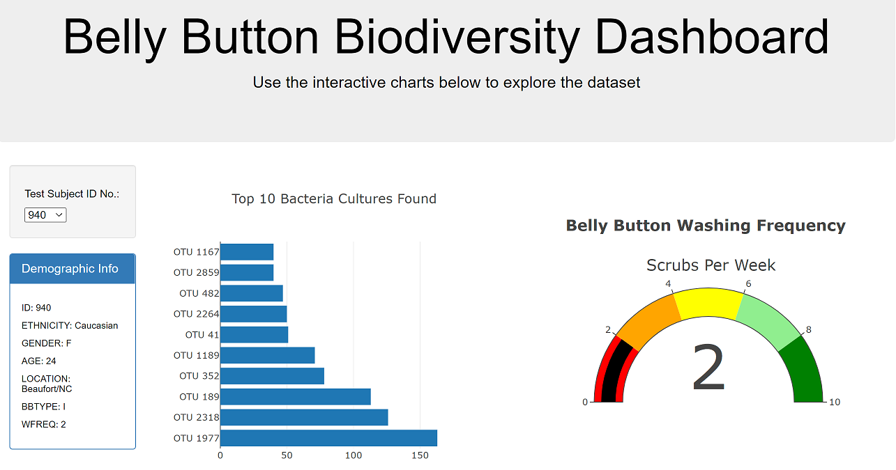
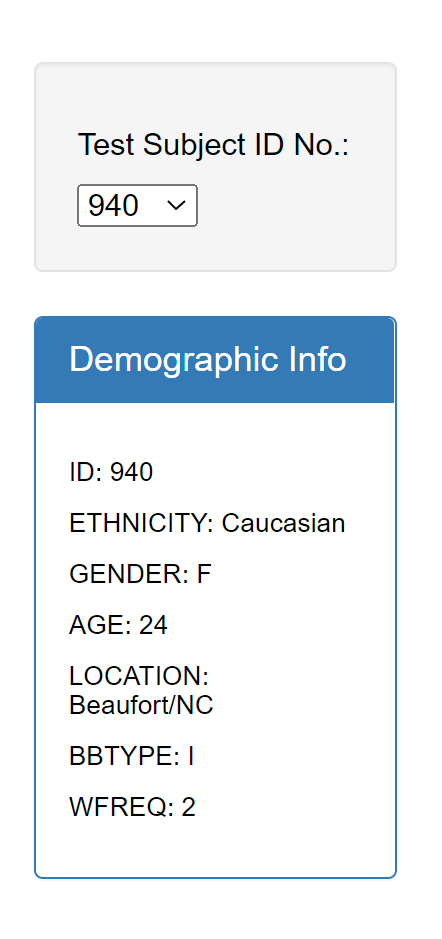
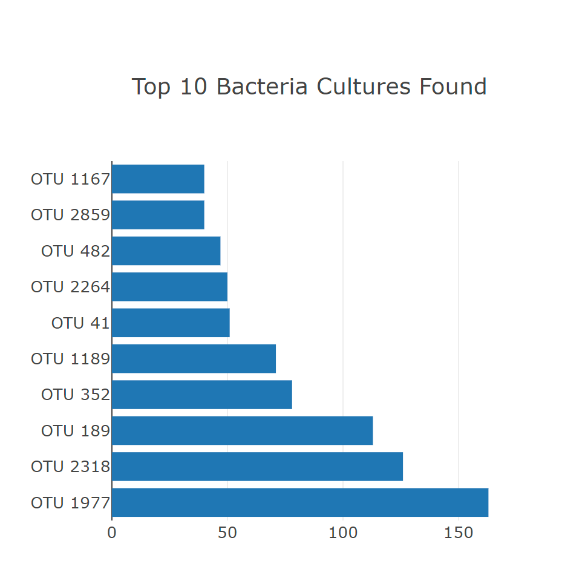
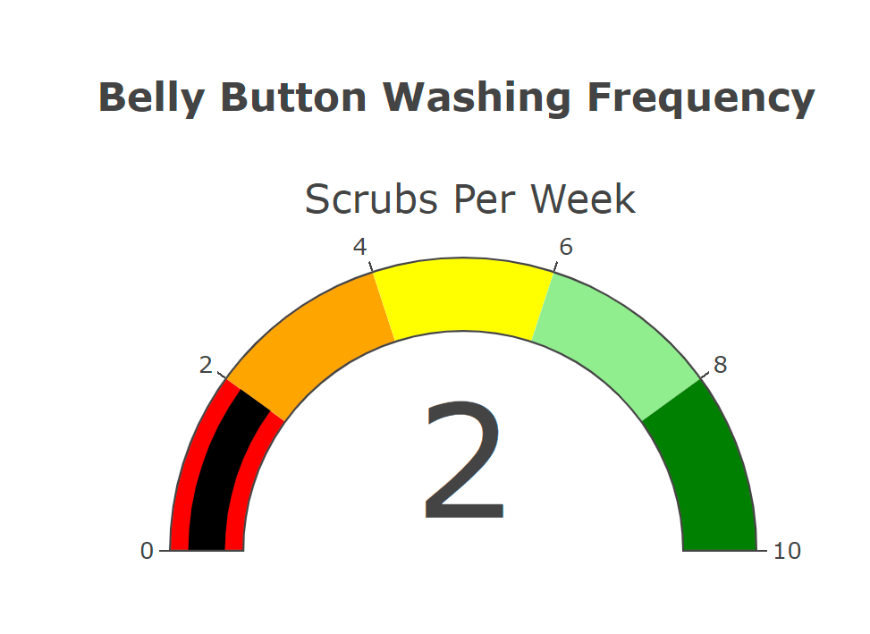
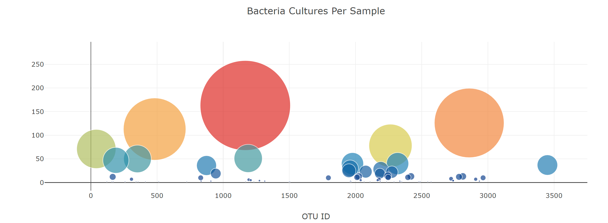

# Plotly_Biodiversity

https://kilobilo416.github.io/Plotly_Biodiversity/

### What the User Sees Upon Initial Site Load

### Dropdown Filter of Test Subject ID's

### Bar Chart

- The y values are the otu_ids in descending order
- The x values are the sample_values in descending order
- The hover text is the otu_labels in descending order.

### Guage Chart 

- Creates the ranges for the gauge in increments of two, with a different color for each increment.
- Adds the washing frequency value on the gauge chart.
- The indicator shows the level for the washing frequency on the gauge.
- The gauge fits in the margin of the 
 element.

## Bubble Chart

- The text for a bubble is shown when hovered over
